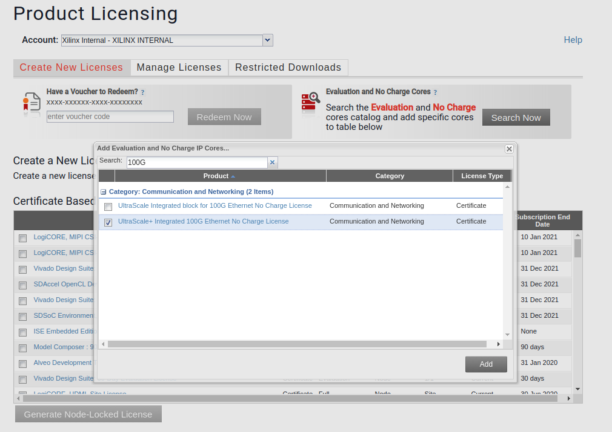

# OpenNIC Platform

The OpenNIC platform delivers an FPGA NIC acompanied with software driver.  It
is built with Vivado 2019.2.  Currently, the supported boards include

- Xilinx Alveo U250,
- Xilinx Alveo U280[*](#u280-note), and
- Bittware 250-SoC.

<a name="u280-note">*</a> As of v0.4.1, dual-port design on U280 has
a clean timing report with default implementation strategy.  Sometimes, Vivado
reports a tiny negative slack (1-8ps as I usually observe) on the max skew of
the PCI-e core clock, which does not seems to be quite reproducible.

The platform consists of a *shell* that implements host and ethernet interfaces,
two *user logic box* that wraps up RTL logic instantiated by users, and a
top-level that connects them.  Its architecture is shown in the figure below.

    -----  -----  ----------------------------------------------------------------
    |   |  |   |  |               shell                                          |
    | S |  |   |  |     ------------------------    ------------------------     |
    | W |  |   |  |     |          V (AXI-Lite)|    |          V (AXI-Lite)|     |
    |   |  | P |  |  Q  |   ----------------   |    |   ----------------   |  C  |
    | D |  | C |  |  D  |   | box_250mhz   |   |    |   | box_322mhz   |   |  M  |
    | R |  | I |  |  M  |==>|              |==>|    |==>|              |==>|  A  |
    | I |  | E |  |  A  |   |  ----  ----  |   |    |   |  ----  ----  |   |  C  |
    | V |  |   |  |     |<==|  |  |  |  |  |<==|    |<==|  |  |  |  |  |<==|     |
    | E |  |   |  |     | | |  ----  ----  | | |    | | |  ----  ----  | | |     |
    | R |  |   |  ------- | ---------------- | ------ | ---------------  | -------
    |   |  |   |          |    AXI-Stream    |        |    AXI-Stream    |
    |   |  |   |          |      250MHz      |        |      322MHz      |
    -----  -----          --------------------        --------------------

## Directory Structure

The repository is organized in the following structure.

    |--- open-nic ---
        |--- hardware ---
            |--- constr ---
            |--- script ---
            |--- shell ---			# Git submodule for “open-nic-shell”
            |--- sim ---
            |--- src ---
                |--- box_250mhz ---
                |--- box_322mhz ---
                |--- passthrough_250mhz ---
                |--- passthrough_322mhz ---
                |--- open_nic.sv
        |--- software ---
            |--- linux-driver ---	# Git submodule for “open-nic-driver”

Under `hardware`,

- `constr` stores constraint files for each board target,
- `script` includes a build script for building and simulating the design as
well as several board-specific scripts,
- `shell` is a Git submodule linked to the `open-nic-shell`
  repository[*](#shell-note),
- `sim` has a system-level simulation environment that is capable of connecting
simulators with Linux kernel network stack, and
- `src` contains RTL source files of the top-level and user logic modules.

<a name="shell-note">*</a> To learn more about the shell, refer to
[README.md](hardware/shell/README.md) of the shell repository.

Under `hardware/src`, the top-level `open_nic.sv` connects user logic box and
the shell.  Normally, users should not modify this file.  To add an user module,
put the source files into a separate directory under `src` and modify the user
logic box to properly instantiate the added module.  The design is shipped with
a sample user module, `passthrough`, which simply connects the datapath.

The software part currently has a single directory, `linux-driver`, which is a
Git submodule linked to the `open-nic-driver` repository.

## Hardware Build Instructions

To build the hardware, run `build.tcl` under `hardware/script` through Vivado
with proper arguments.  Two modes are supports: implementation build and
simulation build.  The former is used to generate FPGA bitstreams, and the
latter prepares an environment for simulation.

It is recommended to build the design with Internet connection, as it relies on
updated Xilinx board files, accessible through [Xilinx Board
Store](https://github.com/Xilinx/XilinxBoardStore).  The build script
automatically updates Vivado against this repository.  See the below section for
build without Internet/Github access.

### Build Script Options

To invoke the build script, run the following command under `hardware/script`.

    vivado -mode batch -source build.tcl -tclargs [-OPTION VALUE] ...

<a name="script-options">A couple of options</a> are available to configure the
design and the build process.  They are divided into build options and design
parameters.

    # Build options

    -board_repo PATH
                path to local Xilinx board store repository for offline build;
                mandatory if Vivado is unable update the board repository

    -board      BOARD_NAME
                supported boards include:
                - au250
                - au280
                - soc250

    -tag        DESIGN_TAG
                string to identify the build; recommended to use when building
                against the same board target with different source files and/or
                design parameters

    -overwrite  0 (default), 1
                indicate whether the script should overwrite existing build
                results

    -jobs       [1, 32] (default to 8)
                number of jobs for synthesis and implementation

    -synth_ip   0, 1 (default)
                indicate whether IPs are synthesized before building top-level

    -impl       0 (default), 1
                indicate whether the script runs towards bitstream generation:
                0 means only creating the project

    -post_impl  0 (default), 1
                indicate whether the script runs post implementation actions:
                for Zynq family (e.g., soc250), 1 means generating the XSA file
                after bitstream; for FPGAs (e.g., au250), 1 means generating the
                MCS file

    -sdnet      PATH
                path to the SDNet executable; mandatory for designs using sdnet

    -sim        0 (default), 1
                Build mode: 0 for implementation, 1 for simulation

    # Design parameters

    -max_pkt_len  [256, 9600] (default to 1514)
                  maximum packet length

    -min_pkt_len  [64, 256] (default to 64)
                  minimum packet length

    -num_q        [1, 2048] (default to 2048)
                  number of QDMA queues

    -max_func     0, 1 (default), 2
                  number of QDMA physical functions

    -max_cmac     1 (default), 2
                  number of CMAC instances

### Implementation Build

If the `-sim` is set to 0 (the default), the script starts an implementation
build.  The process involves four steps.

1. IP creation and out-of-box synthesis
2. Design project setup
3. Synthesis and implementation
4. Post-processing

By default, the script finishes the first two steps, producing a Vivado project
for the design under the build directory.  If `-impl` is set to 1, the third
step is also performed.  The post-processing step is enabled by setting
`-post_impl` to 1.  To adjust the number of jobs, change the value of `-jobs`.

In implementation build, the following macros are defined and made avaiable to
RTL source code.

- Board name, i.e., one of `__au250__`, `__au280__` and `__soc250__`
- For Zynq family device, `__zynq_family__`

Here are a few examples to illustrate the script options and their outcomes.

- Build for Alveo U250 using default design parameters and generate the MCS
  file.

        vivado -mode batch -source build.tcl -tclargs -board au250 -impl 1 -post_impl 1

  The results are stored under `build/open_nic_au250`.

- Build for Alveo U250 for two PFs and two CMAC instances.  Use a tag
  "dual_port" to identify the build.

        vivado -mode batch -source build.tcl -tclargs -board au250 -num_pf 2 -num_cmac 2 -tag dual_port

  The results are stored under `build/open_nic_au250_dual_port`.

- Build for Bittware SoC-250 to test some new feature "awesome".  Start the
  implementation manually without synthesizing the IPs first

        vivado -mode tcl -source build.tcl -tclargs -board soc250 -tag awesome -synth_ip 0

  The results are stored under `build/open_nic_soc250_awesome`.  Running
  in Tcl mode, Vivado leaves us a Tcl shell after finishing, which could be used
  to fine tune the design.

### Simulation Build

The design supports RTL simulation without the QDMA and CMAC IP.  To achieve
this, wrappers are implemented at both ends, replacing the IPs with AXI-stream
and AXI-lite interfaces.  These wrappers are enabled with a `sim` macro
available in the simulation build.  A library that connects the simulated design
with Linux kernel network stack is provided.  Using it, we can run applications
as if these are physical adapters, and investigate every packet passing through
the design.

*Currently, only the QuestaSim simulator is supported*.  Setting `-sim` to 1
enables the simulation build.  In this mode, options `-impl`, `-post_impl` and
`-jobs` are ignored.  The script generates IP simulation wrappers and prepares
scripts for running simulation.

To enable the simulation with kernel network stack, the following are required.

- QuestaSim (only tested with v10.7c)
- UVM (only tested with v1.1d shipped with QuestaSim v10.7c)
- Vivado IP simuation library, which could be compiled against the desired
  simulator through Vivado
- iproute2 package, available through apt-get
- A Linux kernel with namespace configured (CONFIG_NAMESPACES)

Here are the steps.

1. Run the following command under `hardware/script` (assuming Alveo U250 as
   target).

        vivado -mode batch -source build.tcl -tclargs -board au250 -sim 1

   The results are stored under `build/sim_open_nic_au250`.

2. Run the generated script `run_questa_sim.sh` as printed at the end of the
   first step.  The script takes a single argument `SIMLIB_INI`, which is the
   path to the `modelsim.ini` file of compiled simulation library.

3. Open two terminals.  One runs `sudo ip netns exec qdma-ns-0 bash`, and the
   other `sudo netns exec cmac-ns-0 bash`.  There is a `qdma-vlan-0` virtual
   adapter with IP address `192.168.1.10` in the network namespace `qdma-ns-0`,
   and a `cmac-vlan-0` adapter with IP address `192.168.1.20` in `cmac-ns-0`.
   Now we should be able to ping through each other in the respective bash
   session.

4. Stop the simulation by `ctrl+c` in QuestSim session and exit with `exit`
   command.

### Offline Build

If the machine does not have access to Github, we need to have a local copy of
the [Xilinx Board Store](https://github.com/Xilinx/XilinxBoardStore) repository,
and pass the path to the build script via the `-board_repo` option.

### Board Support Package for SoC-250

The standard Petalinux flow for flash programming Bittware SoC-250 requires a
customized board support package (BSP).  It is created from a ZynqMP template,
adding changes which have been documented in the BSP creation guide from
Bittware, which is available at [Bittware Developer
Site](https://developer.bittware.com/) once registered.  The guide is targetd on
Petalinux/Vivado 2018.3.  Thus we need to adapt the changes to Petalinux/Vivado
2019.2 accordingly.  Due to policy reasons, I can only provide the BSP file as
per request for now.

## Interface between Shell and User Logic Box

Shell and user logic box communicates through three types of interfaces.  They are

- AXI-Lite interface, running at 125MHz, for register access,
- AXI-Stream interface, running at the same frequency as the box does (i.e.,
  250MHz or 322MHz), for data path, and
- Synchronous reset interface, running at 125MHz.

The two clock domains, 125MHz and 250MHz, are phase aligned.  Thus signals can
be sampled across each domain without CDC guard.  On the other hand, do note
that different clock frequencies can lead to double sampling and miss of
samples.

The AXI-Stream interface employs `tid` and `tdest` fields to signify the source
and destination of packets.  OpenNIC defines three *domain* in
`hardware/shell/src/open_nic_shell_uid.vh`, QDMA, CMAC and ZYNQ (currently not
used), each of which has its own *pid*s.  Combining both, each
source/destination is defined by an *uid*.  For the QDMA domain, its pid value
refers to the function ID; for CMAC, it refers to CMAC port ID.  User modules
that drive the data path should guarantee valid value of `tdest`.  Shell
components, namely QDMA and CMAC subsystems, check the validity of `tdest`, and
discard packets whose `tdest` is different from `uid` of the receiving side.

User logic box handles the reset of user modules using a pair of reset and reset
done signals.  The protocol is simple.

- When a user writes a certain bit of the user logic reset register, the
  corresponding reset signal is asserted for one clock cycle.  The user module
  is responsible to generate its own reset sequence accordingly.
- When the reset is done, the user module asserts the reset done signal for one
  clock cycle.

## Adding User Modules

This section shows briefly how to add user modules into user logic box.  Details
can be found in the technical reference manual and by reading the comments in
`box_250mhz.sv` and `box_322mhz.sv`.

Two steps are involved to add user modules into the user logic box.

1. Create a directory under `src`.  Put the user module source files under this
   directory and the Tcl scripts for IP generation into a `vivado_ip` directory
   under the newly created directory.
2. Modify user logic box to instantiate the user module, change the AXI-Lite
   address mapping, and connect user reset signals for the module.

### Rules for User Module Directory

The build script treats every directory under `src` as a user module, and
expects it to have the following hierarchy.

    |--- src ---
        |--- box_250mhz ---
        |--- box_322mhz ---
        |--- open_nic.v
        |--- mod_0_250mhz ---
            |--- vivado_ip ---
                |--- vivado_ip.tcl
                |--- mod_0_250mhz_ip_0.tcl
                |--- mod_0_250mhz_ip_1.tcl
                |--- ...
            |--- mod_0_250mhz.[v,sv,vhd]	# top-level of user_mod_0
            |--- ...		     			# other source files
        |--- mod_1_322mhz ---
            |--- vivado_ip ---
                |--- ...
            |--- mod_1_322mhz.[v,sv,vhd]	# top-level of user_mod_1
            |--- ...			    		# other source files

In the above example, there are two user modules, `mod_0_250mhz` and
`mod_1_322mhz`.  Now look at `mod_0_250mhz`.  It has a `vivado_ip` directory in
which there is a `vivado_ip.tcl`.  The build script expects a list variable
`ips` defined by this `vivado_ip.tcl`.  The list `ips` defines the IP Tcl
scripts to be sourced by the build script.  For example, if `vivado_ip.tcl` says

    set ips {
        mod_0_250mhz_ip_0
        mod_0_250mhz_ip_1
    }

the build script will try to source `mod_0__250mhz_ip_0.tcl` and
`mod_0_250mhz_ip_1.tcl`.  It is possible to provide different IP definitions for
different board targets.  For a board name `xxx` and a IP name `abc` in `ips`,
the script `abc_xxx.tcl`, if existed, will be sourced instead of `abc.tcl`.

To prepare Tcl scripts for IP generation, we recommend to have a separate
ManageIP project, which contains customized IPs through Vivado IP Catalog.  A
script, located at `script/export_ip.tcl`, is provided to tailor customized IPs
into a script format required by the OpenNIC build script.

Outside the `vivado_ip` directory are source files of the user module.  The
build script first source a `build.tcl` script under the module directory, if
existed, and then reads in every Verilog/SystemVerilog/VHDL file (i.e., with
extensions .v/.sv/.vhd).  For modules that make use of external compilers/tools
such as SDNet, they can add the necessary steps into `build.tcl` to generate RTL
files.

### Modifying User Logic Box

To add the user module into user logic box, we need to modify three pieces.

1. If the user module requires a module-level reset, connect an unused reset
   pair to its own reset sequence generator.  Make sure that any unused pair has
   its reset done signal tied to 1.
2. If the user module requires an AXI-Lite interface, update
   `box_250mhz_address_map.v` and `vivado_ip/box_250mhz_axi_crossbar.tcl` to
   reflect the address mapping.  Same goes with `box_322mhz`.
3. Instantiate the user module and connect all the signals.

## Known issues

Here are several known issues and potential workarounds.

### Kernel panic/reboot while programming the FPGA

When loading bitstream onto the Alveo U250 board using Vivado's hardware
manager, kernel panic occurred and the system rebooted automatically before the
process was complete.  On subsequent tries it worked in 50% of the cases.

There are a few solutions for different use cases.

- A potential fix is to disable PCIe fatal error reporting and clearing out SERR
  in the command register.  [This
  post](http://alexforencich.com/wiki/en/pcie/disable-fatal) describes the fix.
- Another workaround is to use a different server/workstation to program the
  board, i.e., launching Vivado on a different server/workstation and connecting
  the JTAG/USB cable there.

### Server fails to boot after programming the FPGA

A warm reboot is needed after loading the bitstream onto the FPGA.  But this
reboot fails with the error message: "A PCIe link training failure is observed
in Slot1 and the link is disabled".

For Dell servers, there is a temporary hack [discussed
here](https://forums.xilinx.com/t5/PCIe-and-CPM/PCIE-link-training-error-on-DELL-R730/m-p/806428).
The trick is to issue a second "warm reboot" command using iDRAC while the
system is rebooting and before PCIe endpoint detection.  The hypothesis is that
this gives enough time to load the configuration on the FPGA.  This seems to be
working so far.

### CMAC license issue when building the design

This error was seen when some people tried to build the hardware.

ERROR: [Common 17-69] Command failed: This design contains one or more cells for
which bitstream generation is not permitted:
`cmac_subsystem_inst/cmac_wrapper_inst/cmac_inst/inst/i_cmac_usplus_0_top
(<encrypted cellview>)`.  If a new IP Core license was added, in order for the
new license to be picked up, the current netlist needs to be updated by
resetting and re-generating the IP output products before bitstream generation.

Since the 100G MAC is hardened in Ultrascale+, `cmac_usplus` has a free license.
Go to [www.xilinx.com/getlicense](www.xilinx.com/getlicense).  After login,
click "Search Now" in the "Evaluation and No Charge Cores" box on the right side
of the page.  You will see a popup with a "Search" box at top left.  Enter
"100G" in the search box.  You will see "UltraScale+ Integrated 100G Ethernet No
Charge License".  Select this and click "Add".  A screenshot could be found
.

---

# Copyright Notice and Disclaimer

This file contains confidential and proprietary information of Xilinx, Inc. and
is protected under U.S. and international copyright and other intellectual
property laws.

DISCLAIMER

This disclaimer is not a license and does not grant any rights to the materials
distributed herewith.  Except as otherwise provided in a valid license issued to
you by Xilinx, and to the maximum extent permitted by applicable law: (1) THESE
MATERIALS ARE MADE AVAILABLE "AS IS" AND WITH ALL FAULTS, AND XILINX HEREBY
DISCLAIMS ALL WARRANTIES AND CONDITIONS, EXPRESS, IMPLIED, OR STATUTORY,
INCLUDING BUT NOT LIMITED TO WARRANTIES OF MERCHANTABILITY, NONINFRINGEMENT, OR
FITNESS FOR ANY PARTICULAR PURPOSE; and (2) Xilinx shall not be liable (whether
in contract or tort, including negligence, or under any other theory of
liability) for any loss or damage of any kind or nature related to, arising
under or in connection with these materials, including for any direct, or any
indirect, special, incidental, or consequential loss or damage (including loss
of data, profits, goodwill, or any type of loss or damage suffered as a result
of any action brought by a third party) even if such damage or loss was
reasonably foreseeable or Xilinx had been advised of the possibility of the
same.

CRITICAL APPLICATIONS

Xilinx products are not designed or intended to be fail-safe, or for use in any
application requiring failsafe performance, such as life-support or safety
devices or systems, Class III medical devices, nuclear facilities, applications
related to the deployment of airbags, or any other applications that could lead
to death, personal injury, or severe property or environmental damage
(individually and collectively, "Critical Applications"). Customer assumes the
sole risk and liability of any use of Xilinx products in Critical Applications,
subject only to applicable laws and regulations governing limitations on product
liability.

THIS COPYRIGHT NOTICE AND DISCLAIMER MUST BE RETAINED AS PART OF THIS FILE AT
ALL TIMES.
